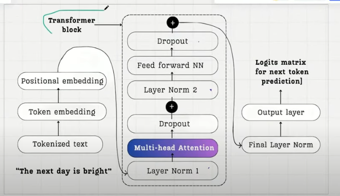

# Build DeepSeek from Scratch - Phase 1: LLM Architecture

**By: Ayushmaan Singh**

## Overview
This lecture introduces the foundational architecture of Large Language Models (LLMs) as part of the "Build DeepSeek from Scratch" series. The focus is on understanding how LLMs work internally before diving into DeepSeek's specific innovations.

## Four Phases of the Series
1. **Phase 1**: Innovative Architecture behind DeepSeek
   - Multi-Head Latent Attention (MLA)
   - Mixture of Experts (MoE)
2. **Phase 2**: Training Methodology & Reinforcement Learning
3. **Phase 3**: GPU Optimization Tricks (NVIDIA PTX/CUDA)
4. **Phase 4**: Model Ecosystem & Distillation (671B → 1.5B parameters)

## DeepSeek's Key Architectural Innovations

### Multi-Head Latent Attention (MLA)
- Makes the attention mechanism more efficient
- Innovation occurs in the multi-head attention block of the transformer

### Mixture of Experts (MoE)
- 671 billion total parameters, but only ~37 billion active at once
- Parameters turn on/off like light bulbs based on need
- Innovation occurs in the feed-forward neural network block

## LLM Architecture Deep Dive

### Core Concept
- LLMs are **Next Token Prediction Engines**
- Similar to a car engine: input (fuel) → processing → output (motion)
- Input: sequence of words → Output: next predicted token

### Three Main Components

#### 1. Input Processing
**Step 1: Tokenization & Isolation**
- Words are separated from their context
- Each word becomes an individual token

**Step 2: Token ID Assignment - Technical Implementation**
- Each token gets a unique ID from a vocabulary (e.g., 50,000 tokens)
- Vocabulary contains characters, words, and subwords
- Created using Byte Pair Encoding (BPE)
- Example: "friend" → Token ID: 20112

**How BPE Actually Works:**
1. Start with character-level vocabulary: [a, b, c, ..., z, space, punctuation]
2. Count frequency of character pairs in training corpus
3. Merge most frequent pair into single token (e.g., "th" appears often → create "th" token)
4. Repeat merging process thousands of times
5. Result: vocabulary with common subwords like "ing", "tion", "pre-"

**Actual Lookup Process:**
```
Input: "friendship"
BPE tokenization: ["friend", "ship"] 
Vocabulary lookup: friend=20112, ship=5847
Output: [20112, 5847]
```

**Step 3: Token Embedding - Technical Implementation**
- **NOT actual questions** - this is a learned lookup table (embedding matrix)
- Matrix shape: [vocabulary_size × embedding_dim] = [50,000 × 768]
- Each token ID maps to one row in this matrix
- Dimension varies by model (GPT-2: 768, larger models: up to 1600)

**How Token Embedding Actually Works:**
1. **Initialization**: Matrix filled with random numbers (e.g., normal distribution)
2. **Lookup**: Token ID 20112 → Row 20112 of embedding matrix → 768 numbers
3. **Training**: Through backpropagation, these 768 numbers gradually learn to represent meaning
4. **Result**: Similar words end up with similar vector representations

**Mathematical Operation:**
```
token_id = 20112
embedding_matrix = torch.randn(50000, 768)  # Initially random
token_vector = embedding_matrix[token_id]   # Simple index lookup
# token_vector is now a 768-dimensional vector
```

**Step 4: Positional Embedding - Technical Implementation**
- **Two main approaches**: Learned vs. Fixed (Sinusoidal)
- Helps distinguish identical words in different positions
- Example: "The dog chased another dog" - both "dog" tokens need position awareness

**Learned Positional Embeddings (GPT-2 style):**
1. **Matrix**: [max_sequence_length × embedding_dim] = [1024 × 768]
2. **Lookup**: Position 0 → Row 0, Position 1 → Row 1, etc.
3. **Training**: Like token embeddings, learned through backpropagation

**Fixed Sinusoidal Embeddings (Original Transformer):**
1. **Formula**: Uses sine/cosine functions at different frequencies
2. **Advantage**: Can handle sequences longer than training data
3. **Calculation**:
```
pos_encoding[pos, 2i] = sin(pos / 10000^(2i/d_model))
pos_encoding[pos, 2i+1] = cos(pos / 10000^(2i/d_model))
```

**Complete Implementation Example:**
```python
# Input sentence: "A true friend"
tokens = ["A", "true", "friend"]
token_ids = [32, 2081, 20112]  # From vocabulary lookup
positions = [0, 1, 2]          # Sequential positions

# Token embeddings (learned)
token_embeddings = embedding_matrix[token_ids]  # Shape: [3, 768]

# Positional embeddings (learned)
pos_embeddings = position_matrix[positions]     # Shape: [3, 768]

# Final input embeddings
input_embeddings = token_embeddings + pos_embeddings  # Element-wise addition
```

**Step 5: Input Embedding Creation**
- Token embedding + Positional embedding = Input embedding
- Results in a single 768-dimensional vector per token
- This becomes the token's "uniform" for the transformer journey

#### 2. Transformer Block Processing
Each token goes through multiple transformer blocks (GPT-2 Small: 12 blocks, GPT-2 XL: 48 blocks)

**Components per Transformer Block:**
1. **Layer Normalization** - Standardizes input (mean=0, std=1)
2. **Multi-Head Attention** - Learns context relationships between tokens
3. **Dropout** - Prevents overfitting by randomly zeroing parameters
4. **Skip Connection** - Helps gradient flow (prevents vanishing gradients)
5. **Layer Normalization** (second)
6. **Feed-Forward Neural Network** - Expands to higher dimensions (768 → 768×4 → 768)
7. **Dropout** (second)
8. **Skip Connection** (second)

**Key Points:**
- Token dimensions remain 768 throughout all transformer blocks
- Each token must traverse ALL transformer blocks sequentially
- Modern GPTs may have 96+ transformer blocks

#### 3. Output Processing
**Final Layer Normalization**
- One last standardization step

**Output Projection Layer**
- Converts 768 dimensions → vocabulary size (50,000 dimensions)
- Creates probability distribution over all possible next tokens

**Next Token Prediction**
- Find highest probability token ID
- Map back to actual word using vocabulary
- Multiple prediction tasks occur simultaneously within one sequence

## The Journey of a Token: Complete Lifecycle

### Analogy: Token as a Student
1. **Isolation**: Separated from classmates
2. **ID Badge**: Assigned unique identifier
3. **First Exam**: Token embedding (meaning test)
4. **Second Exam**: Positional embedding (position test)
5. **Uniform**: Combined results create unique identifier
6. **School Journey**: Pass through 12+ transformer "classrooms"
7. **Graduation**: Final transformation to prediction space
8. **Career**: Contribute to next token prediction

### Parameter Distribution
**Training Parameters (marked with *):**
- Token embeddings*
- Positional embeddings*
- All transformer block components*
- Output projection layer*
- **Total**: 175+ billion parameters (modern models: 1+ trillion)

## Learning Methodology

### Multiple Prediction Tasks
Within sequence "A true friend accepts you":
- Input: "A" → Predict: "true"
- Input: "A true" → Predict: "friend"  
- Input: "A true friend" → Predict: "accepts"
- Input: "A true friend accepts" → Predict: "you"
- Input: "A true friend accepts you" → Predict: [next token]

### Training Process
1. Compare predicted vs. actual tokens
2. Calculate loss function
3. Backpropagate through all parameters
4. Language understanding emerges as byproduct of next token prediction

## Key Insights

### Why Architecture Complexity?
- Language learning requires complex processing
- Context understanding needs attention mechanisms
- Massive parameter count enables nuanced language modeling

### Attention Mechanism Importance
- Determines how much focus each token should give to others
- Example: "I am from Pune, India. I speak..." 
- Model learns to focus on "Pune" and "India" for language prediction

## Next Lecture Preview
The upcoming lecture will cover:
1. Why attention mechanisms are needed
2. Self-attention mechanism
3. Multi-head attention
4. Key-value cache optimization
5. Finally: Multi-Head Latent Attention (MLA)

## Technical Specifications
- **Example Model**: GPT-2 variations
- **Embedding Dimensions**: 768 (varies by model)
- **Vocabulary Size**: 50,000 tokens
- **Transformer Blocks**: 12 (small) to 48+ (large)
- **Parameter Scale**: 175B to 1T+ parameters

---
**Author: Ayushmaan Singh**